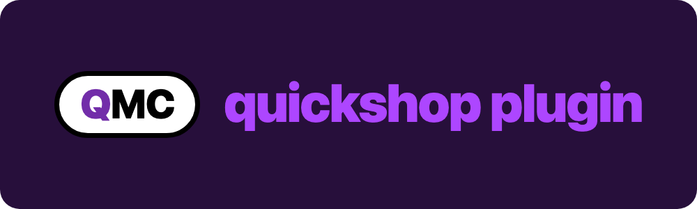

<p align="center">
  
</p>

<h1 align="center">minecraft-plugin</h1>

<p align="center">
  <strong>The Minecraft half of <a href="https://github.com/quick-systems/quickshop">quickshop</a>.</strong>
</p>

<p align="center">
  Polls quickshop for paid but undelivered orders, runs each product's command
  on the server, and broadcasts the sale.
</p>

<p align="center">
  
  
  
</p>

<p align="center">
  <a href="https://quickshop.kotelek.dev">Live site</a> &nbsp;&bull;&nbsp;
  <a href="https://discord.gg/HJJtYx3jJT">Discord</a>
</p>

---

## What it is

A single jar that turns a Minecraft server into the delivery arm of a quickshop
storefront. A player buys a rank on the web, and a few seconds later the command
attached to that product runs in game.

The plugin holds **no payment credentials**. It authenticates to the quickshop
API with a shop id and an API key, claims orders that are already paid for, and
never sees a card or a Stripe key.

One jar covers **1.8 through the latest release**: it compiles to Java 8
bytecode with `api-version: 1.13`, which older servers simply ignore.

## Build

Needs Maven and a JDK. 17 or 21 is fine, since it still targets Java 8 output.

```bash
mvn clean package
```

The jar lands in `target/quickshop-<version>.jar`. Pushes to `main` are also
built and released by the GitHub Actions workflow in
[`.github/workflows/maven.yml`](.github/workflows/maven.yml).

## Install

1. Drop the jar into your server's `plugins/` folder.
2. Start the server once so it writes `plugins/quickshop/config.yml`, then stop
   it.
3. Fill in the config below and start again, or run `/quickshop reload`.

## Configuration

`plugins/quickshop/config.yml`:

| Key | What | Where to find it |
|---|---|---|
| `shopId` | The shop this server delivers for | quickshop dashboard, your shop, **Settings** |
| `apiKey` | An API credential | quickshop dashboard, **Account**, Credentials, **Add new** |
| `serverInternalIp` | This backend's internal address | Proxy networks only. Leave blank on a single server. |
| `checkIntervalSeconds` | Poll interval, minimum 3 | default `5` |
| `deliverToOfflinePlayers` | Deliver even when the buyer is offline | default `true` |
| `broadcastBoughtMessage` | Announce the sale to everyone, or only to the buyer | default `true` |
| `boughtMessage` | The lines sent on a sale | supports `%player%` and `%item%` |
| `debug` | Verbose logging | `false` |

Product commands use `{{player}}` (or `%player%`) as the placeholder, for
example `lp user {{player}} parent add vip`.

### Who sees the sale

`broadcastBoughtMessage: true` announces every sale server-wide. Set it to
`false` and only the buyer gets the message — nothing is sent if they are
offline. An empty `boughtMessage` list sends nothing at all.

The shop can also decide per order: an order carrying a `broadcast` boolean
(`broadcast_message` is accepted too) overrides the config, so a quiet purchase
stays quiet even on a server that broadcasts by default.

### Proxy networks

Running the plugin on several backend servers behind BungeeCord or Waterfall?
In the quickshop dashboard open **Modes** and add one mode per server, each
carrying that server's internal address such as `10.0.0.5:25565`. Set
`serverInternalIp` on each server to the matching address and give every product
a server mode. Each backend then runs only the orders routed to it.

A single server needs none of this.

## Commands and permissions

| | |
|---|---|
| `/quickshop help \| test \| reload` | alias `/qs` |
| `quickshop.test` | test the API connection, default op |
| `quickshop.reload` | reload the config, default op |
| `quickshop.admin` | both of the above plus update notices, default op |

## Verify

- `/quickshop test` should answer *"Connected to the API successfully."* If not,
  re-check `shopId` and `apiKey`.
- Make a test purchase in your shop. The plugin claims the order within a few
  seconds, sends the message and runs the product's command.

## The quick systems family

| Repo | What |
|---|---|
| [**quickshop**](https://github.com/quick-systems/quickshop) | The storefront this plugin delivers for. |
| [**minecraft-plugin**](https://github.com/quick-systems/minecraft-plugin) | This repo. |
| [**quickshop-themes**](https://github.com/quick-systems/quickshop-themes) | Community CSS themes for quickshop storefronts. |
| [**quickpay**](https://github.com/quick-systems/quickpay) | Payments for Discord servers and websites, on the same Stripe Connect plumbing. |
| [**quickpay-bot**](https://github.com/quick-systems/quickpay-bot) | The Discord bot half of quickpay. |

## License

See [LICENSE](LICENSE). Copyright 2024 to 2026
[xKotelek](https://kotelek.dev).
